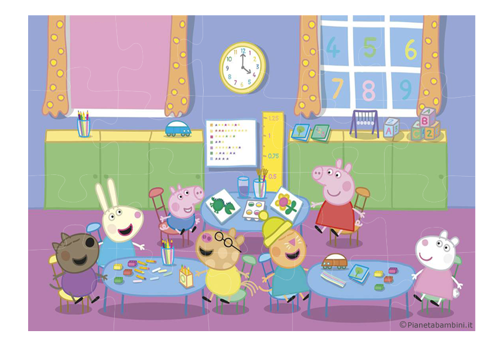
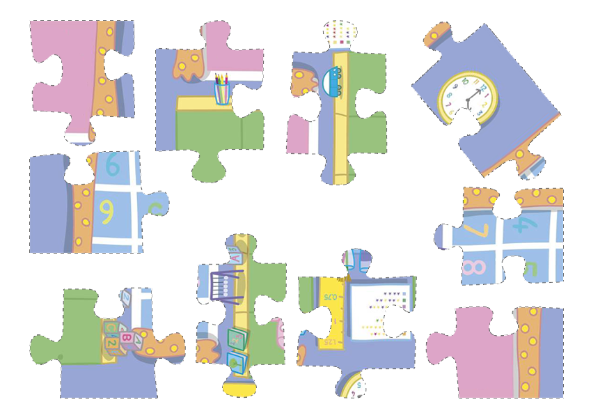

# Peppa Puzzle: Image Segmentation & Matching in Computer Vision

[](https://www.python.org/)
[](https://opencv.org/)
[](https://jupyter.org/)
[](LICENSE)

Progetto per il corso di **Computer Vision (A.A. 2024-25)**.  
L'obiettivo è l'elaborazione, segmentazione ed estrazione automatica delle singole tessere di un puzzle a partire da immagini grezze non strutturate, con successivo matching e ricomposizione rispetto all'immagine target di riferimento.

---

## Pipeline del Progetto

1. **Pre-processing & Thresholding**
   - Caricamento dell'immagine di riferimento (`peppa.png`) e dei fogli con le tessere disposte in modo sparso (`pieces1.png`, `pieces2.png`, ecc.).
   - Conversione da BGR a scala di grigi (`cv.cvtColor`).
   - Binarizzazione tramite sogliatura inversa (`cv.threshold` con `cv.THRESH_BINARY_INV`) per isolare i pezzi dallo sfondo.

2. **Estrazione Contorni e Filtraggio Morfologico**
   - Individuazione dei bordi esterni con `cv.findContours(..., cv.RETR_EXTERNAL, cv.CHAIN_APPROX_SIMPLE)`.
   - Calcolo dell'area media dei componenti connessi e sogliatura automatica (`cv.contourArea`) per rimuovere artefatti, rumore e frammenti spuri, isolando esattamente le tessere del puzzle.

3. **Feature Extraction & Matching**
   - Rilevamento dei punti chiave e descrittori locali (es. SIFT / ORB) sia sulle singole tessere segmentate sia sull'immagine target.
   - Matching dei descrittori con filtraggio dei match robusti (Lowe's Ratio Test).

4. **Stima dell'Omografia e Ricomposizione**
   - Calcolo della matrice di trasformazione prospettica (`cv.findHomography` con RANSAC) per stimare rotazione, scala e traslazione di ciascuna tessera.
   - Posizionamento e sovrapposizione geometrica dei pezzi sul canvas finale.

---

## Risultati Visivi

| Immagine Target | Tessere Originali | Segmentazione e Contorni |
| :---: | :---: | :---: |
|  |  |  |

> *Nota: salva gli screenshot o i grafici di output nella cartella `assets/` per visualizzarli nella tabella sopra.*

---

## Struttura della Repository

```text
peppa-puzzle-cv/
├── assets/                  # Immagini per la documentazione e demo
├── data/
│   ├── peppa/               # Immagini di input (peppa.png, pieces1.png, ...)
│   └── output/              # Risultati della segmentazione e puzzle ricomposto
├── notebooks/
│   └── LAB3-PEPPA.ipynb     # Jupyter Notebook con l'analisi completa e pipeline
├── src/                     # Moduli Python riutilizzabili (opzionale)
├── .gitignore
├── README.md
└── requirements.txt